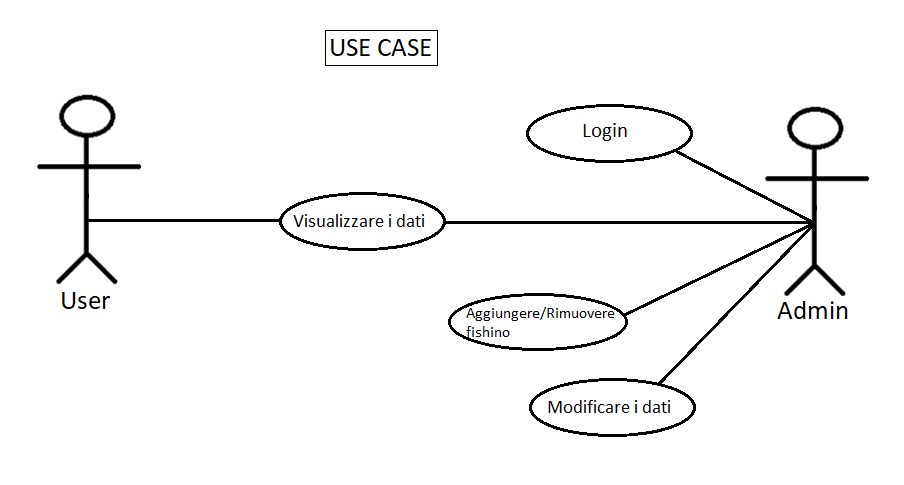
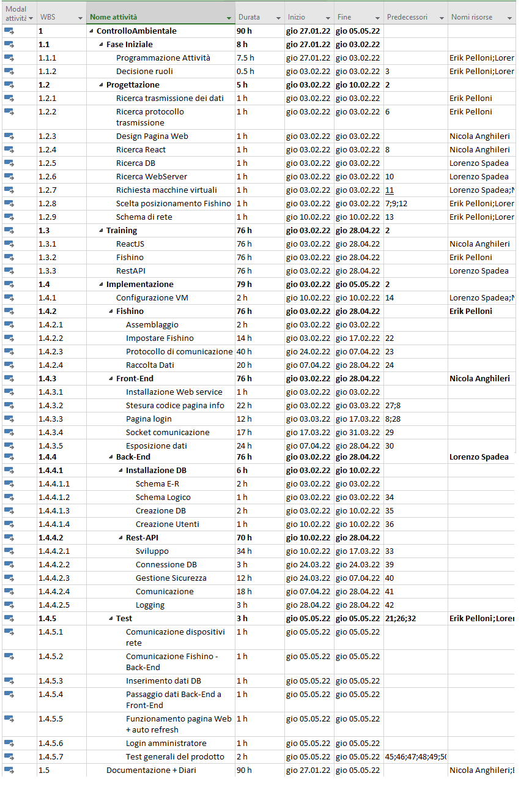
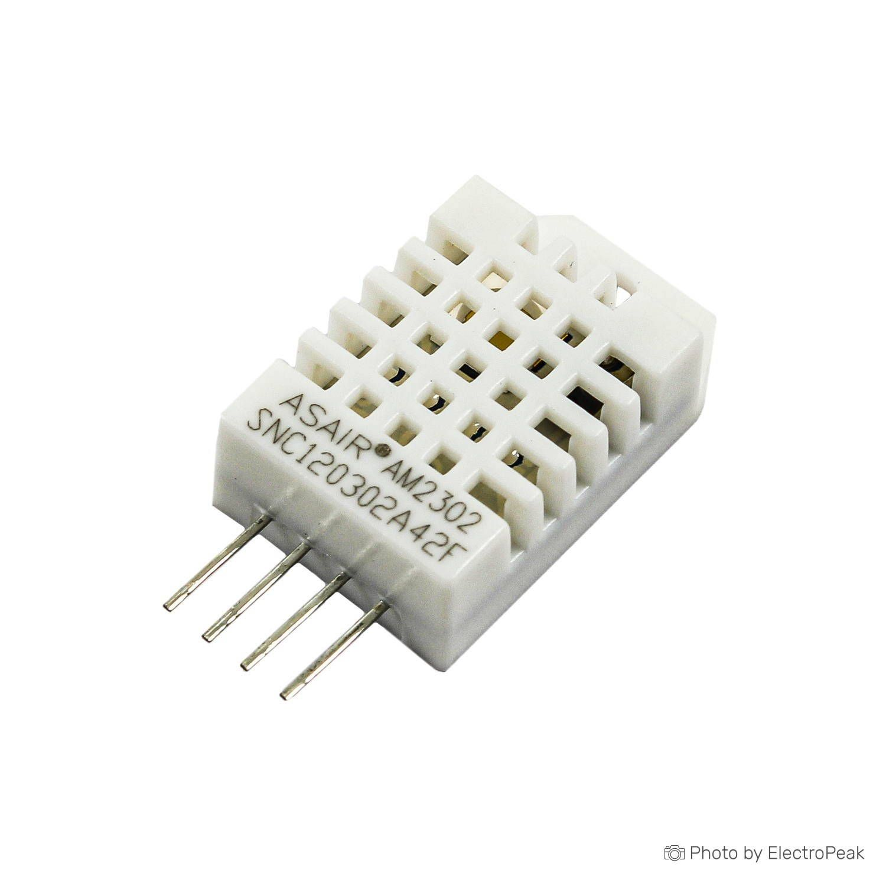
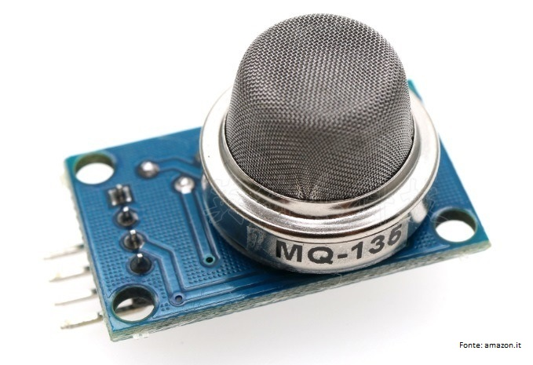
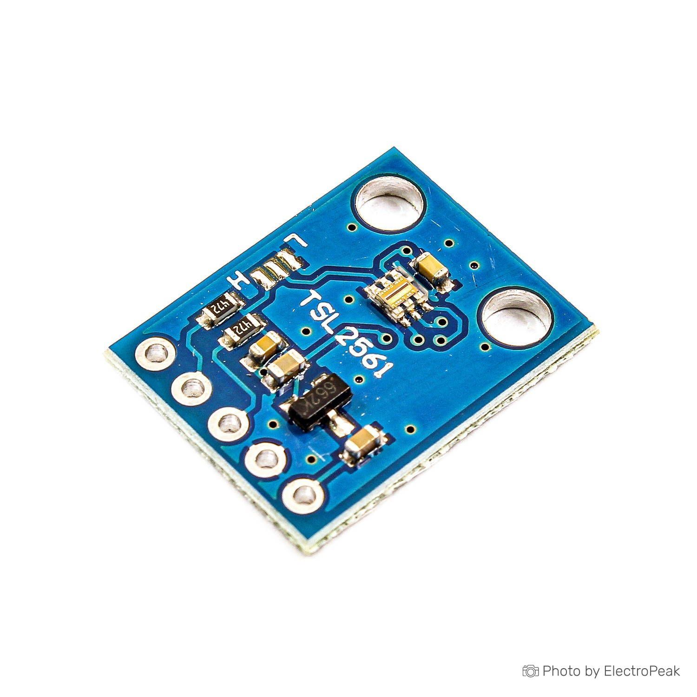
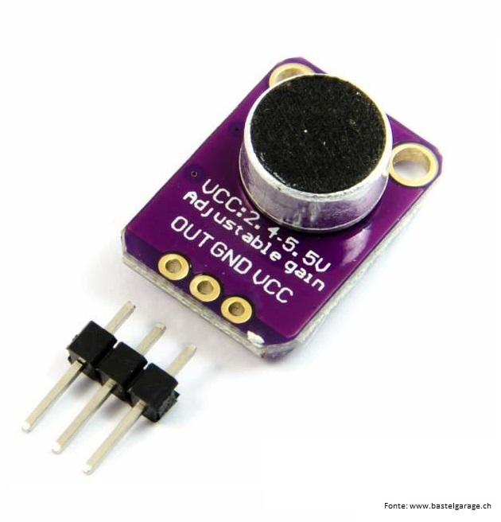
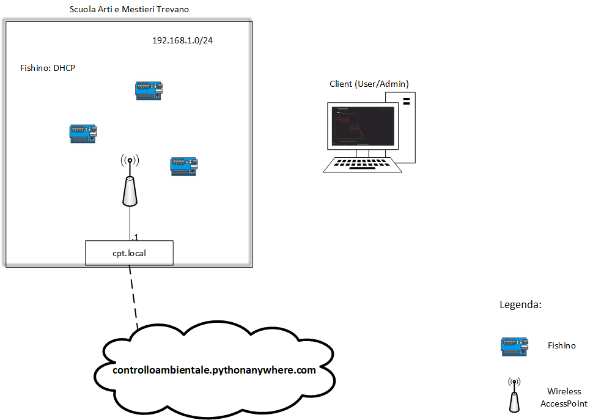
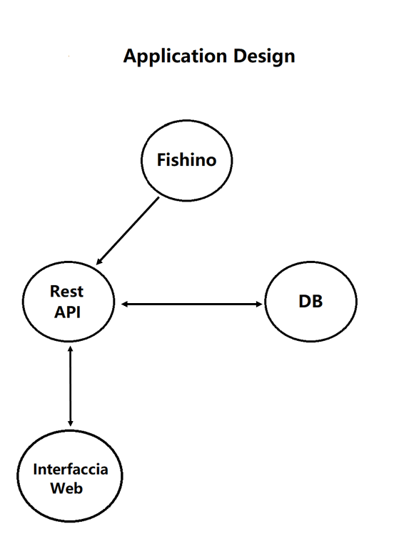
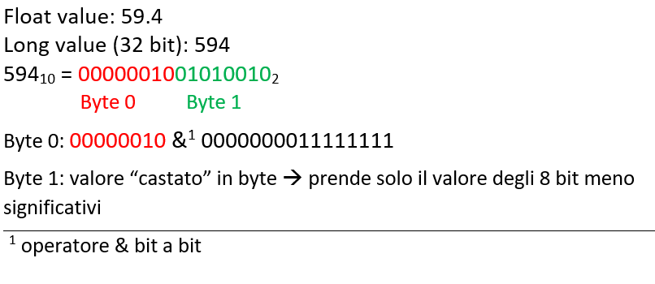
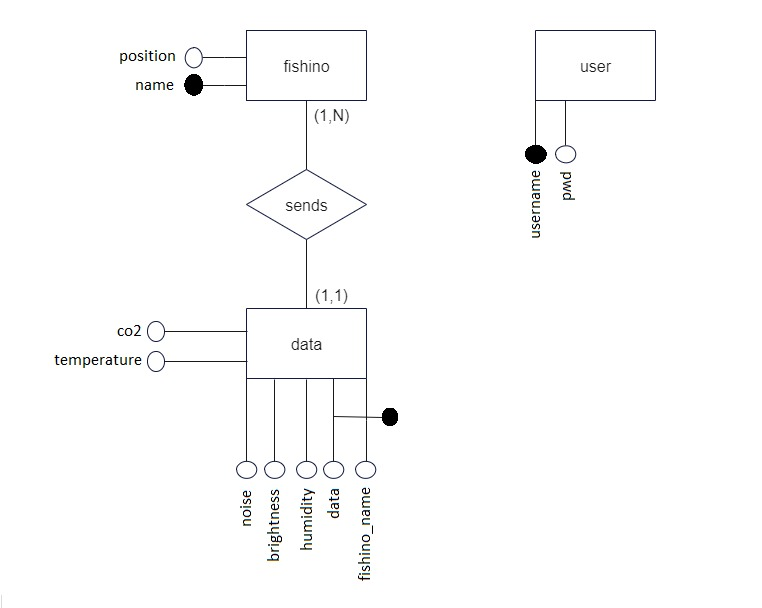

1. [Introduzione](#introduzione)

  - [Informazioni sul progetto](#informazioni-sul-progetto)

  - [Abstract](#abstract)

  - [Scopo](#scopo)

1. [Analisi](#analisi)

  - [Analisi del dominio](#analisi-del-dominio)
  
  - [Analisi dei mezzi](#analisi-dei-mezzi)

  - [Analisi e specifica dei requisiti](#analisi-e-specifica-dei-requisiti)

  - [Use case](#use-case)

  - [Pianificazione](#pianificazione)

    - [Gantt preventivo](#gantt-preventivo)

1. [Progettazione](#progettazione)

  - [Design dell’architettura del sistema](#design-dell’architettura-del-sistema)

  - [Design dei dati e database](#design-dei-dati-e-database)

1. [Implementazione](#implementazione)

  - [Fishino](#fishino)

    - [Protocollo di comunicazione](#Protocollo-di-comunicazione-(non-completato-e-non-utilizzato))

      - [Conversione da float a bytes](#Conversione-da-float-a-bytes)
    
    - [Lettura dati sensori](#lettura-dati-sensori)

      - [MAX4466](#MAX4466-(Sensore-suono))

      - [TSL 2561](#TSL-2561-(Sesore-luminosità))
      
      - [DHT22](#DHT-(Sensore-umidità-e-temperatura))

      - [MQ 135](#MQ-135-(Sensore-qualità-aria))

    - [Connessione alla rete Wireless](#Connessione-alla-rete-Wireless)

    - [ Comunicazione Fishino - Applicazione](#Comunicazione-Fishino---Applicazione)

      - [createPacket](#createPacket)

      - [sendData](#sendData)

      - [Struttura pacchetto HTTP](#Struttura-pacchetto-HTTP)

    - [Lettura dati scheda SD](#lettura-dati-scheda-sd-non-implementato)

1. [Test](#test)

  - [Protocollo di test](#protocollo-di-test)

  - [Risultati test](#risultati-test)

  - [Mancanze/limitazioni conosciute](#mancanze/limitazioni-conosciute)

1. [Consuntivo](#consuntivo)

1. [Conclusioni](#conclusioni)

  - [Sviluppi futuri](#sviluppi-futuri)

  - [Considerazioni personali](#considerazioni-personali)

  - [Erik](#Erik)

1. [Sitografia](#sitografia)

  - [Fishino](#sitografia-fishino)

1. [Allegati](#allegati) 


## Introduzione

### Informazioni sul progetto
  - Autori: Nicola Anghileri, Erik Pelloni, Lorenzo Spadea.
  - Classe: I3BB
  - Docente responsabile: Geo Petrini, Guido Montalbetti
  - Data inizio: 27.01.2022
  - Data fine: 05.05.2022 

### Abstract

  > *Nowadays it can be important and interesting to know information about the 
  > ambiental situation in workplaces.
  > The "Controllo Ambientale" project allows you to analyse data on temperature, 
  > humidity, air quality, noise and brightness in a very simple way, 
  > also using simple and effective graphics.
  > So there is a website that provides graphs containing this data.
  > Furthermore, it is possible to see the trend of these data over time, also thanks to averages.
  > This data is measured by sensors connected to devices located at various places within the fourth floor of the school.*

### Scopo

  Lo scopo del progetto è quello di creare un applicativo Web, che tramite l'uso di diversi 
  fishino, posizionati all'interno della scuola, andrà a fornire dei dati ambientali (poi mostrati sotto forma di grafici).
  I dati che verrano elaborati riguardano la luminosità dell'ambiente, l'umidità,
  la quantità di CO2 presente nell'aria e la temperatura. Grazie all'interfaccia WEB si 
  potrà intuitivamente controllare lo stato dell'ambiente dove si trova un fishino specifico.


## Analisi

### Analisi del dominio

  In questo momento non sappiamo a cosa sia sottoposto il nostro corpo mentre siamo all'interno della nostra sede scolastica, 
  questo è il motivo per cui esiste il nostro progetto, verranno installati diversi apparecchi che raccolgono 
  dati inerenti alla qualità dell'aria, al rumore, all'umidità e alla temperatura.
  Grazie a questi dati raccolti ogni 5 minuti in diverse posizioni all'interno della nostra sede scolastica, 
  potremo scoprire se esistono dei problemi, come ad esempio la qualità dell'aria troppo bassa ecc...
  Al momento in alcune classi sono già presenti dei sensori che forniscono dei dati riguardo il valore di CO2,
  il tutto però non è facilmente accessibile agli allievi. Questo verrà migliorato e facilitato grazie al nostro progetto, il quale si occuperà di raccogliere i 5 dati importanti, 
  già elencati in precedenza e di renderli accessibili tramite la creazione di grafici intuitivi.

### Analisi e specifica dei requisiti


|**ID**	|**Nome**			                                    |**Priorità**|**Vers**|**Note**  |
|-------|-------------------------------------------------|------------|--------|----------|
|Req-001|Scrivere il codice per la raccolta e trasmissione|1           |1.0     |          |
|Req-002|Protocollo trasmissione                          |1           |1.0     |          |
|Req-003|Progettare e realizzare case                     |3           |1.0     |          |
|Req-004|Salvataggio dati in DB                           |1           |1.0     |          |
|Req-005|Elaborazione dati tempo reale                    |2           |1.0     |          |
|Req-006|Scelta grafici sito                              |1           |1.0     |          |
|Req-007|Sistema amministrazione                          |1           |1.0     |          |
|Req-008|Host separati per Web e DB                       |1           |1.0     |          |
|Req-009|Associazione con MAC Address                     |1           |1.0     |          |


### Use case

<br><br>

|**Tipo**	|**Cosa può fare**			                                    |
|---------|-----------------------------------------------------------|
|User     |Vedere i grafici dell'ambiente attraverso la GUI           |
|Admin    |<ul><li>Aggiungere ed eliminare istanze di fishino dalla lista</li><li>Eliminare dati</li><li>Creare utenti</li></ul>|

<br>

### Pianificazione

Una delle prime attività svolte dal gruppo è stata la pianificazione. Per svolgerla
abbiamo usato Microsoft Project come supporto per creare il diagramma di Gantt.

Abbiamo deciso i diversi ruoli e abbiamo strutturato il diagramma in base a quest'ultimi.
Le attività all'interno dell'implementazione sono divise nei sottogruppi `Fishino`, `Front-End` e `Back-End`.

Un diagramma di Gantt è comodo per la pianificazione di un progetto. 
Con l'ausilio di questo strumento è possibile scomporre un grande progetto in piccole attività utilizzando il metodo 
[top-down](https://it.wikipedia.org/wiki/Progettazione_top-down_e_bottom-up),rendendolo più semplice e chiaro da affrontare.

#### Gantt preventivo




### Analisi dei mezzi

#### **Descrizione componenti Fishino**

***DHT 22, temperatura e umidità***



Questo sensore misura la temperatura in gradi Celsius e l'umidità in percentuale.

I dati vengono immagazzinati dentro a dei pacchetti di 5 byte composti in questo modo:

Dal più al meno signficativo nell'ordine: Byte alto umidità relativa, Byte basso umidità
relativa, Byte alto temperatura, Byte basso temperatura, Checksum.

I valori decimali vengono moltiplicati per 10, come nell'esempio seguente:

`Se l'umidità è del 59.4%, verrà salvato il numero 594 in questa composizione: il primo byte è 0000 0010 e il secondo è 0101 0010.`

La stessa cosa avviene anche per la temperatura (terzo e quarto byte).
L'ultimo bit (il 16°), però, rappresenta il segno: vale 1 se la temperatura
è negativa e 0 se è postiva.

|Alimentazione|Pin|
|-------------|---|
|5V           |2  |

<br>

***MQ 135, qualità dell'aria***



Questo sensore misura la qualità dell'aria e i gas contenuti in essa.

La lettura analogica ritorna 1023 (valore massimo) se non viene rilevato gas. 
Quando c'è gas, il valore sarà più alto.
Dalle misure che ho preso in classe, in una situazione normale il valore si aggira attorno ai 20-30, facendo analizzare il gas dell'accendino il valore sale fino
anche fino a 920.
I valori analogici sono 0 se c'è gas e 1 se non ce n'è.


|Alimentazione|Pin|
|-------------|---|
|5V           |A0 |

<br>

***TSL 2561, luminosità***



```cpp
tsl.enableAutoRange(true)
``` 
configura il "gain" automaticamente in base all'amiente circostante. 
È utile per non dover cambiare il codice in base al fatto che le misurazioni siano prese
all'interno, all'esterno o con diverse situazioni. Il gain può essere configurato
manualmente con un valore che va da 1x a 16x.

Di default, il sensore ritorna i dati in unità `lux`, cioè il risultato di complessi
calcoli matematici basati sui valori registrati dal sensore.

Questo sensore ritorna valori nel range [0.1; 40'000], castati poi in int siccome vengono
sempre misurati dei numeri interi.


|Alimentazione| Pin      |
|-------------|----------|
|3.3V         |SDA e SCL |

<br>

***MAX 4466, microfono (suono)***



I suoni misurati possono assumere valori da 0.00 a 3.30, cioè il valore in volt.
Questo valore viene trasformato in decibel utilizzando la formula
`20 * log(Audio output voltage/ Audio input voltage)` 


|Alimentazione|Pin|
|-------------|---|
|3.3V         |A1 |

<br>

#### **Librerie Fishino**

<br>

***Fishino*** Versione 8.0.0

Questa libreria è stata utilizzata per gestire tutta la parte di connessione alla rete e con il server, quindi anche l'invio dei dati.

La documentazione completa è disponibile a questo [link](https://www.fishino.it/libraries.html).

***Wire***

Questa libreria è stata utilizzata per la comunicazione tra il fishino e i sensori.

La documentazione completa è disponibile a questo [link](https://www.arduino.cc/en/reference/wire).

***Adafruit_Sensor*** Versione 1.1.5

Questa libreria è stata utilizzata per leggere nel modo corretto i dati registrati dai sensori.
Sono state utilizzate anche delle librerie specifiche per certi sensori.
Tutte queste implementano metodi e attributi che semplificano la lettura dei dati, ad esempio l'attributo
`light` per la lettura della luminosità del sensore TSL.

La documentazione completa è disponibile a questo [link](https://github.com/adafruit/Adafruit_Sensor).

***Adafruit_TSL2561_U***

Questa libreria è specifica per la lettura dei dati interenti alla luminosità letti dal sensore TSL2561.

La documentazione completa è disponibile a questo [link](https://github.com/adafruit/Adafruit_TSL2561).

***DHT***

Questa libreria è specifica per la lettura dei dati interenti alla temperatura e all'umidità letti dal sensore DHT22.
Sono presenti dei metodi molto comodi come ad esempio
```cpp
readHumidity()

readTemperature()
```
<br>

**Librerie utilizzate ma non implementate completamente**

Queste librerie sono state utilizzate per la stesura del codice, però, purtroppo, le parti di codice dove vengono utilizzate
non sono implementate nel codice finale a causa di problemi (di natura sconosciuta) con la lettura della scheda sd.

***Fishino SdFat*** Versione 8.0.0

Questa libreria mette a disposizione dei metodi utili per ciò che riguarda la lettura dei file presenti all'interno della scheda microSd
integrata nel Fishino.

Il repository originale è disponibile a questo [link](https://github.com/systronix/SdFat_greiman).

***ArduinoJson*** Versione 5.13.5

Questa libreria permette di leggere e scrivere in formato Json.

La documentazione completa è disponibile a questo [link](https://arduinojson.org/v5/doc/).

## Progettazione

### Design dell’architettura del sistema

<!-- DIMENSIONI ORIGINALI 

-->


#### Application Design

<!-- DIMENSIONI ORIGINALI 

-->


### Design dei dati e database

Per questo progetto abbiamo deciso di utilizzare un database MySQL.
<!--agiungere le info per il db-->

### Schema E-R, schema logico e descrizione.

### Design delle interfacce

### Design procedurale

## Implementazione

### **FISHINO**

### Protocollo di comunicazione (non completato e non utilizzato)
**Al posto di questo, viene utilizato il protocollo HTTP**

Segue una descrizione del protocollo di comunicazione che è stato creato per permettere ai vari Fishino
di passare i dati all'applicazione web.

#### Conversione da float a bytes
Questi sono i metodi utilizzati per memorizzare il valore delle variabili di tipo long (numeri interi di 32 bit) e
float (numeri a virgola mobile di 32 bit) all'interno di 2 byte.

```cpp
byte *long2bytes(long number)
{
  byte *array = new byte[2];
  long value = (long)(number * 10);
  //shift, mask and put in array
  array[0] = (number & 65280) >> 8;
  array[1] = (byte)number;
  return array;
}

byte *float2bytes(float number)
{
  return long2bytes((long)(number * 10));
}
```

Partendo dal principio: `byte*` significa `puntatore di byte`, in questo caso simile ad un array, cioè
una sequenza di valori all'interno della memoria.

Questi metodi prendono il valore, poi con degli shift e con dei cast li inseriscono all'interno del puntatore.

Lo schema seguente mostra, in modo più dettagliato, il funzionamento di questi metodi.



I valori float vengono trasformati in valori interi (nel caso specifico, `long`) semplicemente facendo una moltiplicazione
per 10, poi vengono trattati nello stesso modo in cui vengono trattati i numeri interi.

Come detto in origine, nel progetto, questi metodi non vengono utilizzati, siccome è sato deciso di utilizzare il protocollo HTTP, 
già presente all'interno di librerie per Fishino.

### Lettura dati sensori

#### MAX4466 (Sensore suono)

Per leggere correttamente i dati del sensore MAX4466 bisogna impostare i valori `sample` e `sample window` (finesrta di sample).
Vegono poi letti i dati per un certo lasso di tempo, dato dalla finestra di sample.

Il valore passato come output è la quantità di rumore in volt.
Questo viene convertito in decibel utilizzando la formula già documentata in precedenza (vedi documentazione sensore). 


#### TSL 2561 (Sesore luminosità)

Come prima cosa bisogna generare un evento. Per assegnargli un valore viene poi utilizzata la libreria documentata precedentemente.

```cpp
sensors_event_t event; // creo l'evento
tsl.getEvent(&event); // gli assegno un valore. 
```

la variabile `tsl` è di tipo `Adafruit_TSL2561_Unified`, *per maggiori informazioni leggere il capitolo riguardante le [librerie](#Librerie-Fishino)*.

Se il valore `event.light` è maggiore di 0, allora il valore viene salvato.
Se il valore invece è uguale a 0, significa che molto probabilmente il sensore è andato in overload.

#### DHT (Sensore umidità e temperatura)

La lettura di umidità e temperatura avviene semplicemente utilizzando i metodi messi a disposizione dalla libreria DHT, come nel seguente esempio.

```cpp
void readTemperature() {
  // salvo il valore nella variabile
	temperature = dht.readTemperature();
}
```

`dht` è una variabile di tipo `DHT`, *per maggiori informazioni leggere il capitolo riguardante le [librerie](#Librerie-Fishino)*.

#### MQ 135 (Sensore qualità aria)

Per leggere il  valore misurato dal sensore MQ 135 basta semplicemente leggere il valore sul pin analogico al quale è collegato.

Possono poi essere utilizzate delle formule per calcolare percentuali o altri dati come le parti per milione (ppm).

### Connessione alla rete Wireless

La connessione alla rete viene effettuata all'interno del metodo `connectWiFi()`.

```cpp
void connectWiFi() {
	while (!Fishino.begin(SSID, PASSWORD)) {}
	Fishino.staStartDHCP();
	Serial.print("Connecting to WIFI..");
	while (Fishino.status() != STATION_GOT_IP) {
		Serial.print(".");
		delay(300);
	}
}
```

Si può notare che in questo metodo viene utilizzata la classe `Fishino`, [documentata in precedenza](#Librerie-Fishino).

Questo metodo prova a connettersi alla rete specificata e aspetta finché non riceve un indirizzo IP.
Una volta ricevuto l'indirizzo si è connessi alla rete.

Questo metodo viene richiamato all'interno del metodo `setup` per effettuare la prima connessione e nel metodo `loop` per
permettere la riconnessione nel caso in cui il fishino si scolleghi dalla rete.

**SSID:** nome della rete alla quale ci si deve connettere
**Password:** password della rete alla quale ci si deve connettere

### Comunicazione Fishino - Applicazione

La comunicazione tra i fishino e l'applicazione avviene tramite richieste HTTP 1.1.
La creazione di questi pacchetti è documentata qui sotto:

#### createPacket

Il metodo `createPacket()` si occupa di creare il corpo della richiesta, cioè la parte formattata in Json contenente i dati rilevati.

Questo metodo ritorna una stringa contenente la richiesta da inviare al server.

#### sendData

Il metodo `sendData` si occupa di diverse cose:
1. Stabilire la connessione con il server
1. Inviare il pacchetto HTTP al server*
1. Chiudere la connessione con il server

\* il metodo sendData si occupa anche di completare il pacchetto HTTP nel momento in cui lo invia, aggiungendo l'header.

#### Struttura pacchetto HTTP

I pacchetti HTTP inviati dai fishino hanno la seguente struttura

```http
POST <route> HTTP/1.1
Host: <host>
User-Agent: FISHINO_CA
Content-Type: application/json
Content-Length: <length>

{"chip": <chip_name>, "humidity": ..., "temperature": ..., "airQuality": ..., "decibels": ..., "light": ...}
```

Al posto di `<route>` viene messo il percorso (all'interno del sito) al quale mandare i dati.

È indispensabile lasciare una riga vuota tra l'header e il contenuto della richiesta.

Questo pacchetto viene ricevuto e poi interpretato dal server.

### Lettura dati scheda SD (non implementato)

A causa di errori di natura sconosciuta (magari qualche problema con la versione del firmware) non è stato
possibile implementare il metodo che permettesse la lettura dei dati salvati sulla scheda sd integrata al fishino.

Non siamo riusciti a capire nello specifico che errori producesse, siccome questo metodo corrompe il funionamento
del programma senza sollevare eccezioni e senza un criterio preciso.

Sulla scheda sd sono salvati i seguenti dati: `nome del fishino`, `ssid`, `password WiFi`, `server` al quale mandare
i dati.

Il metodo per la lettura del file txt contenente le informazioni salvate in formato json è riportato qui sotto

```cpp
void getSdconfigJson() {
	Serial.println("Init SD card");
	SdFat sd;

	while (!sd.begin(chipSelect, SD_SCK_MHZ(15))) {
		sd.initErrorPrint();
	}
	File config_file;
	char config_line[180];
	int char_index = 0;
	char byte_config;

	Serial.println("Reading config");
	config_file = sd.open("config.txt", FILE_READ);
	while (config_file.available()) {
		byte_config = config_file.read();
		if (byte_config >= 32 && byte_config <= 126) {
			config_line[char_index] = (char)byte_config;
		}
		char_index++;
	}
	config_file.close();
	jsonBuffer.clear();
	Serial.println("Parsing config data");
	JsonObject &json = jsonBuffer.parseObject(config_line);

	chip_number = json["chip_number"];
	ssid = json["ssid"];
	password = json["password"];
	server = json["server"];

	jsonBuffer.clear();
	Serial.println("SD letta");
}

```

Gran parte di questo metodo è stato preso dal codice steso qualche anno fa da Emanuele Piatti 
(ex. Apprendista del docente Geo Petrini), il quale si era già cimentato in questo progetto.

### **Applicazione**
#### Applicativo lato client.
La struttura della repository di lavoro è stata strutturata seguendo l'ordine utilizzato da molti programmatori in python.


#### **app/static/**
Contenitore di tutti i file necessari per la creazione dello stile della pagina, contiene solamente file .css.

#### **app/templates/**
Contenitore dei file .html, utilizzati per la creazione della struttura del sito internet. 

#### **app/templates/page**
Contiene le pagine di default caricate da layout.html, che sono navbar.html e footer.html, la barra di navigazione che verrà utilizzata per navigare tra le diverse pagine messe a disposizione, ed il footer che è il contenitore del Copyright di questo sito.

#### **app/app.py**
File principale del nostro applicativo. Viene utilizzato per istanziare l'applicativo stesso, grazie all'utilizzo della libreria di nome "Flask", viene utilizzato inoltre per gesitre tutte le richieste che vengono fatte da parte dell'utente, come il login o le richieste dei dati.

#### **app/graphs.py**
Una classe creata per la gestione e creazione dei grafici mostranti i dati raccolti dai dispositivi di nome fishino, utilizzati per questo.
Questa classe viene però utilizzata all'interno di app.py.

#### **app/requirements.txt**
File contentente tutte le librerie utilizzate all'interno dell'intero applicativo, utile per tener traccia, e per il team working.

### Implementazione dell'applicativo

```python
app = Flask(__name__)
app.secret_key = "lachiavepiusegretadelmondo"
bcrypt = Bcrypt(app)
```

La prima cosa che viene eseguita nel file principale del nostro applicativo sono le righe di istanziamento, della classe principale, chiamata "app", grazie alla classe "Flask".
Per aggiungere un livello di sicurezza, la libreria "Flask", nel momento in cui si parla di rendere online l'applicativo, ci viene chiesto di impostare una stringa che fungerà da chiave per i movimenti della nostra applicazione.

Per l'utilizzo della libreria Bcrypt per rendere sicure le password salvate nel database bisognerà associare la class Bcrypt, al nostro applicativo princiapale.

```python
def get_connection():
  try:
    cnx = mysql.connector.connect(user='ControlloAmbient',password='apYv#C-wg*b7gn6f',host='ControlloAmbientale.mysql.pythonanywhere-services.com',database='ControlloAmbient$ca')
    logging.debug('connection established')
    return cnx
  except mysql.connector.Error as err:
    logging.exception('error during db connection' , msg=err)
```
Per la connessione facile e veloce al nostro database creato e hostato sul sito di pythonanywhere, è stata creata questa funzione, che servirà per ritornarci una connessione attiva al nostro database funzionante, in modo da poter eseguire una query.

Questo viene fatto grazie al connector creato da mysql, da poter utilizzare con del codice in python, grazie al metodo fornito "connector.connect" possiamo eseguire le nostre richieste.

```python
def get_data(data_type,fishino,option):
    cnx = get_connection()
    cursor = cnx.cursor(dictionary=True)
    query = ""
    if option == 1:
        query = ("SELECT data,{} FROM data where DATE(data)=CURDATE() AND fishino_name='{}'").format(data_type,fishino)
    elif option == 2:
        query =  ("SELECT DATE(data) as data, ROUND(AVG({})) as {} FROM data WHERE data > now() - INTERVAL 1 WEEK  AND fishino_name='{}' GROUP BY DATE(data)").format(data_type,data_type,fishino)
    elif option == 3:
        query =  ("SELECT DATE(data) as data, ROUND(AVG({})) as {} FROM data WHERE data > now() - INTERVAL 1 MONTH AND fishino_name='{}' GROUP BY DATE(data)").format(data_type,data_type,fishino)
    elif option == 4:
        query = ("SELECT DATE_FORMAT(`data`, '%Y-%m') as data, ROUND(AVG({})) as {} FROM data WHERE fishino_name='{}' GROUP BY DATE_FORMAT(`data`, '%Y-%m') ORDER BY data DESC LIMIT 12").format(data_type,data_type,fishino)
    elif option == 5:
        query = ("SELECT DATE(data) as data, ROUND(AVG({})) as {} FROM data WHERE data > now() - INTERVAL 10 MINUTE").format(data_type, data_type)


    cursor.execute(query)
    output = cursor.fetchall()

    labels = []
    dati = []

    for row in output:
      labels.append(row['data'])
      dati.append(row[data_type])

    merge = [dati,labels]
    cursor.close()
    cnx.close()
    return merge
```
Una funzione utilizzata nella nostra classe principale è get_data, passando a questa funzione 3 parametri:

- data_type la rappresentazione testuale del tipo di dato che vogliamo richiedere.
- fishino il nome del fishino presente all'interno del nostro database.
- option la rappresentazione numerica dello spazio temporale da richiedere, 1 - Oggi, 2 - Scorsa settimana, 3 - Scorso mese, 4 - Scorso anno.

In base all'option inserito, verranno eseguite delle richieste al database differenti, ovviamente le differente sono il tempo in cui noi vogliamo ricevere i nostri dati.
Grazie ai valori del nome del fishino, e del tipo di dato che vogliamo, possiamo rendere la nostra richiesta, più libera.

### Spiegazione delle route

#### **/**

La route principale del nostro applicativo web.

#### **/fishino**

La route contentene la lista intera di tutti i dispositvi attivi e non all'interno del nostro applicativo.

#### **/fishino/data**

La route utilizzata per il ricevimento dei dati mandati tramite il protocollo http dai fishino.

#### **/fishino/<fishino>**

La route utilizzata per la visualizzazione dettagliata dei dati raccolti da un singolo fishino di nome <fishino>, viene mostrata anche la scelta personalizzata del range temporale che si vuole visualizzare.

#### **/login**

La route utilizzata per eseguire il login nell'applicativo web.

### **Route per amministratori**

#### **/fishino/delete/<fishino>**

La route utilizzate per eliminare completamente sia dalla tabella Fishino che tutti i dati nella tabella Data, il fishino di nome <fishino>.

#### **/logout**

La route utilizzata per eseguire il logout dall'applicativo web.

#### **/add_user**

La route utilizzata per aggiungere un utente amministratore all'applicativo web.

#### **/add_fishino**

La route utilizzata per aggiungere un fishino all'applicativo web.

## Implementazione delle route
In questo capitolo andrò ad elencare le parti più importanti e più utilizzate all'interno delle specifiche route.


**/**
Questa route esegue una singola riga di codice

```python
return render_template('index.html',params())
```

Questa route, ritorna direttamente il rendering di una pagina html, più precisamente della pagina index dell'applicativo, aggiungendo però dei parametri. Questi parametri sono i valori utilizzati per la rappresentazione dell'attuale stato dei valori, se sono presenti dei valori registrati pericolosi questi verranno mostrati grazie all'array params().

**/fishino**

```python
cnx = get_connection()
cursor = cnx.cursor(dictionary=True)
cursor.execute("SELECT * FROM fishino")
```

In questa route, si va ad eseguire una richiesta al database, utilizzando la funzione get_connection() spiegata in precedenza, la richiesta consiste nella lista di tutti i fishino presenti. Sia attivi che inattivi.


**/fishino/data**

```python
content_type = request.headers.get('Content-Type')

insert_data(name , humidity , brigthness , noise , co2 , temperature)
```
In questa route viene letto il tipo del contenuto in entrata, visto l'utilizzo del protocollo HTTP per la trasmissione dei dati, deve essere controllato e grazie alla funzione ```headers.get('Content-Type')```, possiamo andare a leggere direttamente quale è il tipo di contenuto scritto nel paccetto HTTP che stiamo per ricevere.

Una volta ricevuti i dati si possono andare a salvare nel database, utilizzando la funziona creata da noi di nome insert_data, che va semplicemente ad eseguire un INSERT nella tabella data di sql.


**/fishino/<fishino>**

La route utilizzata per far vedere tutti i grafici all'utente, viene renderizzata una pagina html, alla quale viene passata come parametro un'immagine di tipo svg che sarebbe frutto della funzione create_graph, create all'interno della classe graphs.py.
Questa immagine rappresenta il grafico con al suo interno i dati del fishino selezionato fishino/fishino.

```python
return render_template("graphics.html",graph_data_1=create_graph(fishino,get_fishino_position(fishino),"co2",dataco2[0],dataco2[1],get_time_string(option)),
```

**/login**

La route utilizzata per il login contiene un controllo, questo controllo guarda se la richiesta è POST, questo vuol dire che un utente sta sicuramente tentando di accedere al nostro sito.
Se questo è il caso allora grazie all'utilizzo della classe ```bcrypt``` possiamo utilizzare il metodo 
```bcrypt.check_password_hash(pwd,password)```, grazie a questo metodo possiamo controllare se la password inserita dall'utente che vorrebbe accedere  al nostro sito, corrisponde alla password presente nel database. Visto però che la password è stata criptata, possiamo eseguire questo confronto solo grazie a questa funzione. Avendo usato la classe ```bcrypt``` all'inserimento della password nel database.

```python
if request.method == "POST":
  ...

  if data:
        user, pwd = data
        pwd = bytes(pwd).decode("utf-8")
        if bcrypt.check_password_hash(pwd,password):
          session["login"] = True
          session["username"] = uname
          return redirect(url_for('index'))
        else:
            return render_template("login.html",msg="Wrong password")
    else:
        return redirect("login.html",msg="Username does not exists")
```

**Route per amministratori**

Per controllare se un utente è effettivamente registrato nel nostro sito viene utilizzata: 
```python
if session["login"] == True:
```


**/fishino/delete/<fishino>**

La parte più importante eseguita da questa route sono le due eliminazioni dal datbase, importante da notare è che la prima istruzione ```delete``` deve essere eseguita prima, per evitare errori dal database, che non permette un'eliminazione di dati, se essi contengono riferimenti ad un'altra tabella con delle chiavi esterne. Grazie alla prima istruzione eliminiamo le chiavi esterne, e poi con la seconda istruzione ```delete2```, andremo ad eliminare il fishino dalla sua tabella.

```python
delete = (f"DELETE FROM data WHERE fishino_name='{fishino}'")
delete2 = (f"DELETE FROM fishino WHERE name='{fishino}'")
```

**/logout**

In logout basterà pulire la sessione creata in precedenza, quindi eliminare i dati salvati, come lo username dell'utente registrato, e poi ridirezionare l'utente appena uscito, alla pagina di Home, per evitare di sporcare l'url di route invalide.

```python
  session.clear()
  return redirect(url_for('index'))
```

**/add_user** e **/add_fishino**
L'unica cosa eseguita da queste due route sono un'inserimento dei dati all'interno delle loro rispettive tabelle, dopo aver controllato che non fossero già esistenti.

```python
statement = """INSERT INTO fishino(name , position) VALUES (%s,%s)"""
```

### Creazione grafici con pygal
Per la creazione dei grafici utilizzati per visualizzare i dati raccolti con più facilità, è stata utilizzaza la libreria pygal, essa offre tante possibilità di grafici differenti, offre la possibilità di cambiare lo stile e molto altro.


```python
def create_graph(fishino_id, position, type, values, labels, time):
	try:
		graph = pygal.Line(style=custom_style)
		graph.title = "{} detected by {} at {} {}".format(type,fishino_id, position, time)
		graph.x_labels = labels
		graph.add(type, values)
		graph_data = graph.render_data_uri()
		return graph_data
	except Exception as e:
		return(str(e))
```
Grazie a pygal che ci offre la possibilità di utilizzare i suoi oggetti preconfezionati come ad esempio ```pygal.Line```, che sarà il tipo di grafico da noi utilizzato, e poi assegnando ai vari attributi i loro valori, possiamo poi alla fine visualizzare un bel grafico.

Vengono infatti attribuiti dei valori ```graph.title```, che sarà il titolo del nostro grafico, al quale viene attribuito una stringa formattata con le informazioni più importanti.

Vengono assegnati i ```labels```, che sono i valori presenti sull'asse delle x.
Nel nostro caso sono il riferimento temporale ai nostri dati.

Infine vengono assegnati con ```graph.add```, i valori veri e propri, raccolti dal nostro fishino.


## Database
Il database utilizzato per il salvataggio dei dati ricevuti dai fishino è stato MySql, quindi un database relazionale.

Lo schema ER è il seguente:



Come possiamo vedere abbiamo 3 entità:

- Fishino
- Data
- User

Fishino e Data sono relazionati fra di loro, essendo che in ogni riga presente in Data, possiamo trovare il riferimento al Fishino che ha mandato questi dati.

Invece l'entità user non necessita un collegamento alle altre entità perchè viene semplicemente utilizzato per contenere il nome e la password degli utenti che hanno il diritto di poter accedere al sito web, e di poter accedere alle route riservate a amministratori.

## Test

### Protocollo di test

I seguenti test sono basati sull'[analisi e specifica dei requisiti](#analisi-e-specifica-dei-requisiti),
per testare il corretto funzionamento dell'applicazione.

#### Test Fishino

|Test Case            | TC-001                                         |
|---------------------|------------------------------------------------|
|**Nome**             | Raccolta dati                                  |
|**Riferimento**      | REQ-001                                        |
|**Descrizione**      | I dati inerenti all'ambiente vengono raccolti  |
|**Prerequisiti**     | Fishino, sensori e parte di codice funzionanti |
|**Procedura**        | Far partire un programma che misuri e ritorni (magari stampando a terminale) i valori dell'ambiente (temperatura,...) |
|**Risultati attesi** |I dati vengono raccolti e stampati correttamente|

|Test Case            | TC-002                                         |
|---------------------|------------------------------------------------|
|**Nome**             | Invio dati                                     |
|**Riferimento**      | REQ-001                                        |
|**Descrizione**      | I dati raccolti vengono inviati correttamente al server  |
|**Prerequisiti**     | Fishino, sensori e parte di codice funzionanti |
|**Procedura**        | Far partire un programma che misuri e invii i valori dell'ambiente (temperatura,...). Controllare che siano arrivati correttamente al server |
|**Risultati attesi** |I dati vengono inviati e ricevuti correttamente |

|Test Case            | TC-003                                         |
|---------------------|------------------------------------------------|
|**Nome**             | Protocollo trasmissione                        |
|**Riferimento**      | REQ-002                                        |
|**Descrizione**      | I dati vengono inviati utilizzando un protocollo di trasmissione adeguato  |
|**Prerequisiti**     | Codice sorgente                                |
|**Procedura**        | Controllare che l'invio dei dati avvenga tramite un protocollo adeguato (ad esempio HTTP) |
|**Risultati attesi** | Viene utilizzato un protocollo adeguato        |

|Test Case            | TC-004                                         |
|---------------------|------------------------------------------------|
|**Nome**             | Lettura dati scheda SD                         |
|**Riferimento**      | N/D                                            |
|**Descrizione**      | Dati inerenti al fishino e alla connessione Wi-Fi sono salvati sulla scheda SD. Questi dati vengono letti e utilizzati  |
|**Prerequisiti**     | Fishino, scheda sd e parte dicodice funzionanti|
|**Procedura**        | Controllare che questi dati vengano presi dalla scheda SD e che non siano messi a mano nel codice. |
|**Risultati attesi** | I dati sono scritti e vengono letti sulla/dalla scheda SD|

|Test Case            | TC-005                                         |
|---------------------|------------------------------------------------|
|**Nome**             | Identificazione                                |
|**Riferimento**      | REQ-009                                        |
|**Descrizione**      | I fishino vengono identificati tra di loro     |
|**Prerequisiti**     | Fishino funzionante, connessione alla rete     |
|**Procedura**        | Testare che i fishino siano riconoscibili uno con l'altro |
|**Risultati attesi** | Ogni fishino possiede un'informazione univoca  |

|Test Case            | TC-006                                         |
|---------------------|------------------------------------------------|
|**Nome**             | Progettazione Case                             |
|**Riferimento**      | REQ-003                                        |
|**Descrizione**      | È stato progettato un case nel quale inserire i fishino |
|**Prerequisiti**     | -                                              |
|**Procedura**        | -                                              |
|**Risultati attesi** | Il case è stato progettato                     |


### Risultati test

| ID Test | Passato | Non Passato | Note                       |
|---------|---------|-------------|----------------------------|
| TC-001  | ✔      |             |                            |
| TC-002  | ✔      |             |                            |
| TC-003  | ✔      |             | Viene utilizzato HTTP 1.1  |
| TC-004  |        | ✘           | Ci sono stati degli errori con la lettura della scheda|
| TC-005  | ✔      |             | Sono distingubili grazie al nome (ad es. dratini, eevee,...)|
| TC-006  |        | ✘           | Questo requisito aveva un'importanza minima|

### Mancanze/limitazioni conosciute


## Consuntivo


## Conclusioni

Siamo riusciti a soddisfare tante richieste iniziali nonstante i moltissimi errori avuti durante lo svolgimento, purtroppo non per colpa nostra.

### Sviluppi futuri

1. Lettura dati fishino dalla scheda SD.

2. Aggiornamento dei grafici in tempo reale.

3. Modifica dell'orario di inserimento dei dati.

4. Dare all'utente la possibilità di decidere una soglia.
   
### Considerazioni personali

#### Erik

È stato un progetto molto interessante e sono veramente contento di averne preso parte. È stato impegnativo, però sono davvero contento 
del risultato finale che è stato raggiunto grazie alla nostra dedizione.

Il lavoro in gruppo secondo me è andato abbastanza bene. Ci siamo divisi i "compiti" all'inizio del progetto e ognuno ha lavorato sulla
propria parte. Personalmente, avendo lavorato con i fishino, in genere ero abbastanza distaccato, rispetto a Nicola e Lorenzo, che lavorando
su Front-end e Back-end si sono dovuti confrontare di più durante tutto lo svolgimento del progetto. Mi sono trovato a mio agio a lavorare con loro.

Il cambiamento del linguaggio di programmazione utilizzato per creare il sito dopo qualche mese dall'inizio, ha cambiato la progettazione, e per
forza di cose ha ritardato tutto il progetto. Nonostante questo siamo riusciti però ad arrivare ad un prodotto (secondo me) soddisfacente.

Sono contento di aver preso parte a questo progetto anche perché in questo modo ho potuto aumentare le mie esperienze per ciò che riguarda
arduino e la gestione di un progetto, anche con dei compagni.

#### Nicola

Sono partito con delle aspettative troppo alte per questo progetto, purtroppo sono stato demotivato per colpa dei moltissimi errori dati dal sistema della nostra scuola.

Dopo però aver deciso di cambiare linguaggio, per colpa dei tanti errori avuti in precedenza, ho finalmente ritrovato una sfida che mi interessava, allora ho continuato a lavorare ai problemi che mi venivano dati, per risolverli il meglio possibile.

Purtroppo non mi è stato possibile eseguire il mio lavoro alla perfezione come avrei voluto fare, ma sono comunque molto soddisfatto del mio lavoro. In particolare dell'ultima lezione in cui io ed Erik siamo stati molto produttivi. E siamo riusciti a recuperare tutti i problemi che erano ancora in sospeso.


## Sitografia

### Sitografia Fishino

- https://www.open-electronics.org/fishino-arduino-become-wireless/, *fishino: arduino become wireless*, 10.02.2022

- https://www.open-electronics.org/fishino-lets-look-inside-the-features/, *fishino: lets look inside the features*, 10.02.2022

- https://www.settorezero.com/wordpress/misurare-temperatura-e-umidita-relativa-con-il-sensore-dht22-e-un-picmicro/, 
*Misurare Temperatura e Umidità relativa con il sensore DHT22 e un microcontrollore PIC*, 10.02.2022

- https://microcontrollerslab.com/interfacing-mq-135-gas-sensor-arduino/, 
*Interfacing of MQ135 Gas Sensor with Arduino*, 10.02.2022

- https://create.arduino.cc/projecthub/m_karim02/arduino-and-mq-135-gas-sensor-with-arduino-code-a8c1c6,
*Arduino And MQ 135 Gas Sensor With Arduino Code*, 10.02.2022

- https://learn.adafruit.com/tsl2561/arduino-code, *TSL2561 Luminosity Sensor*, 10.02.2022

- https://www.engineersgarage.com/tsl2561-light-sensor-with-arduino/, *TSL2561 light sensor with arduino*, 10.02.2022


- https://learn.adafruit.com/adafruit-microphone-amplifier-breakout/measuring-sound-levels, *Adafruit Microphone Amplifier Breakout*, 17.02.2022

- https://www.codrey.com/electronic-circuits/how-to-use-mq-135-gas-sensor/, *How to use mq-135 gas sensor*,
17.02.2022

- https://www.olimex.com/Products/Components/Sensors/Gas/SNS-MQ135/resources/SNS-MQ135.pdf, *SNS-MQ135*, 17.02.2022


### Sitografia Fishino

- https://www.python.org/, 05.05.2022
- https://flask.palletsprojects.com/en/2.1.x/, 05.05.2022
- https://www.pygal.org/en/stable/documentation/, 05.05.2022

## Allegati

-   [Diari di lavoro](../Diari)

-   [Codice sorgente fishino](../../Fishino/Sketch/ControlloAmbientale/ControlloAmbientale.ino)

-   [Quaderno dei compiti](../qdc.docx)

-   [Link al sito](https://controlloambientale.pythonanywhere.com)
